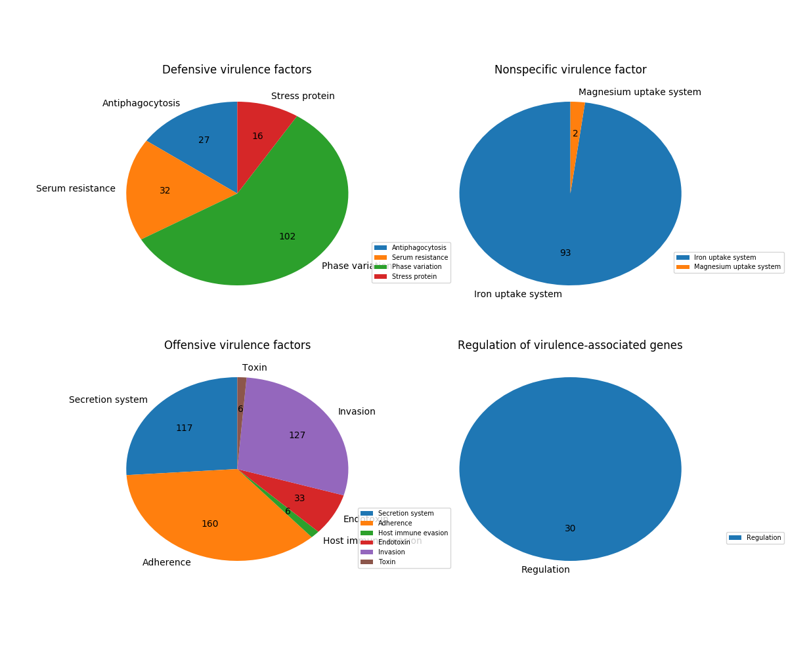

# vfdb_crawler
a crawler of [VFDB](http://www.mgc.ac.cn/VFs/main.htm) to get the vfs class information.

# Install

```
# download and install
git clone git@github.com:ZhihaoXie/vfdb_crawler.git

# usage, no args
python3 ./vfdb_crawler.py
```

Require:

+ requests
+ BeautifulSoup4

# Output

4 files of VFDB, see the vfdb_info directory

+ VFDB_gene_dna.ffn: vfs gene dna sequences
+ VFDB_gene_protein.faa: vfs gene protein sequences
+ VFDB_gene_info.txt: information about vfs gene, include Accession, COG etc
+ VFDB_level_gene_link.txt: the vfs class information


# Other tools

There are some useful tools (script) for VFDB.

## 1. pie plot

If you had blast your protein seqs (as query) to VFDB, like VFDB_setB_pro.fas, next step you can draw a pie plot. example:

```
# Note: Suppose you've installed perl, related modules of Perl, and NCBI blast+.
# first, run blastp
blastp -query yourprotein -out protein.VFs.bsp -db VFDB_setB_pro.fas -evalue 1e-10 -outfmt 0 -num_threads 10 -num_descriptions 10 -num_alignments 10
# parse of vfs blastp output and pie plot
perl ./tools/parse_VFDB_blastOut.pl protein.VFs.bsp | awk '\$0!~/No hit/' > VFs_blastp_out.tsv
python3 ./tools/vfdb_classsum_and_plot.py VFs_blastp_out.tsv out_prefix
```

Then pie plot example like this:

